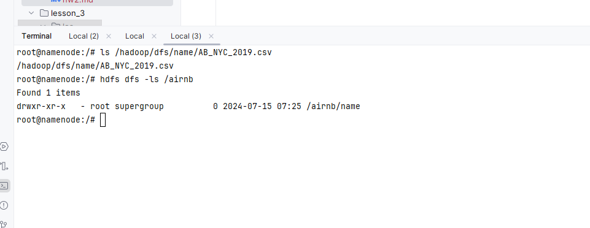

Загрузите датасет по ценам на жилье Airbnb, доступный на kaggle.com: https://www.kaggle.com/dgomonov/new-york-city-airbnb-open-data
Подсчитайте среднее значение и дисперсию по признаку ”price” в hive
Используя Python, реализуйте скрипт mapper.py и reducer.py для расчета
Проверьте правильность подсчета статистики методом mapreduce в сравнении со hive.

### Подключаюсь к контейнеру namenode:

docker exec -it namenode bash
ls /hadoop/dfs/name/AB_NYC_2019.csv

hdfs dfs -mkdir /airnb
hdfs dfs -put /hadoop/dfs/name/ AB_NYC_2019.csv /airnb/
hdfs dfs -ls /airnb



### Подключаюсь к контейнеру hive-server:

docker exec -it hive-server bash

#### Запускаю Beeline и создаю таблицу:

beeline -u jdbc:hive2://localhost:10000

```sql
CREATE DATABASE airbnb;
USE airbnb;

CREATE EXTERNAL TABLE airbnb_listings (
id INT,
name STRING,
host_id INT,
host_name STRING,
neighbourhood_group STRING,
neighbourhood STRING,
latitude DOUBLE,
longitude DOUBLE,
room_type STRING,
price INT,
minimum_nights INT,
number_of_reviews INT,
last_review STRING,
reviews_per_month DOUBLE,
calculated_host_listings_count INT,
availability_365 INT
)
ROW FORMAT DELIMITED
FIELDS TERMINATED BY ','
LINES TERMINATED BY '\n'
STORED AS TEXTFILE
LOCATION '/airbnb';
```

В будущем, с увеличением данных, можно будет рассмотреть возможность использования более эффективных форматов, таких как Parquet или ORC. Эти форматы сжимают данные и хранят метаданные, что ускоряет запросы.

Сравним количество строк в исходном файле и в таблице базы


Видим, что строк одинаковое количество
#### Загружаю данные в таблицу:

```sql
LOAD DATA INPATH '/airbnb/AB_NYC_2019.csv' INTO TABLE airbnb_listings;
```


#### Посчитаем mean() и var()

**в Pandas :**


**в hive :**

```sql
SELECT AVG(price), VARIANCE(price) FROM airbnb_listings;
```


```
Используя Python, реализуйте скрипт mapper.py и reducer.py для расчета
Проверьте правильность подсчета статистики методом mapreduce в сравнении со hive.
```
cat .\AB_NYC_2019.csv | .\mapper_mean.py | .\reducer_mean.py

`152.7206871868289`

cat .\AB_NYC_2019.csv | .\mapper_var.py | .\reducer_var.py

`57672.84569843345`

Заметно, что результат pandas и mapreduce не отличается, но есть разница с hive.
